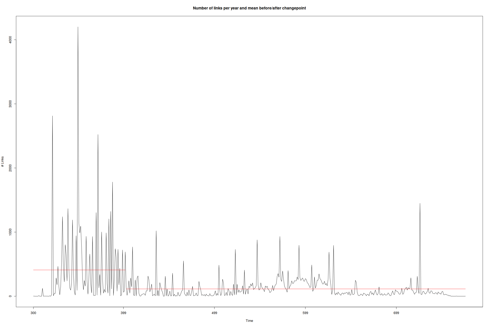

# Late antiquity trade analysis via social networks and shift point analysis 𓊝



Repository for papers, data and stuff related to the analysis of coin hoards for
change points in late Antiquity/early Middle Ages in Europe.

The [repository with code, paper source and data is in GitHub](https://github.com/JJ/medieval-trade).

## Papers

For the time being, these papers:


* An extended report is published at the UGR institutional repository, ["Finding
  changepoints in medieval European and Middle Eastern trade
  networks"](https://hdl.handle.net/10481/105018), where the "Danubian
  hypothesis" is proposed: The change in trade patterns before and after the
  changepoint suggest that the fall of the Danube as a trade route internal to
  the empire, as well as probable the *Via Militaris* that run parallel to it,
  totally changed the trading patterns, decreasing the number of trade links and
  creating economic and finally military and political change.

* For [Statphys 29](https://statphys29.org/): "Finding changepoints in medieval Mediterranean trade networks", check the
  [paper source](abstract-medieval-trade.Rnw) as well as [the paper](https://github.com/JJ/medieval-trade/releases/download/v1.02/abstract-medieval-trade.pdf). The file
  [`data/links_year.rds`](data/links_year.rds) contains the data processed for
  the
  paper. [`scripts/abstract-medieval-trade.R`](scripts/abstract-medieval-trade.R)
  contain the extracted script that generates the chart in the paper, slightly
  modified for the actual poster.


If you want to use the processed data and/or code in this paper, we kindly
request you to cite:

```bibtex
@Article{complexities2020012,
AUTHOR = {Merelo-Guervós, Juan Julián},
TITLE = {Analyzing Late Antiquity Shifts of Trade Regime in the Iberian Peninsula and Their Causes via Change Point Detection Methods},
JOURNAL = {Complexities},
VOLUME = {2},
YEAR = {2026},
NUMBER = {2},
ARTICLE-NUMBER = {12},
URL = {https://www.mdpi.com/3042-6448/2/2/12},
ISSN = {3042-6448},
ABSTRACT = {History attempts to make sense of disparate information by trying to create discourse that lays a series of events with crisp cause–effect relationships in a sequence. Epochal shifts, such as the change from Antiquity to the Middle Ages, are especially complex since they involve a large number of economic, political and even religious factors which occur over long periods and that might overlap and interact through reciprocal feedback mechanisms, making this cause–effects sequence difficult to establish. In this research we adopt a data-driven and well-established methodology to identify, with quantifiable statistical precision, the moment when this shift happened, and from there arrive at its possible causes. We will use historical coin hoard data to find out whether such a shift is detected in a peripheral part of the Roman Empire, the Iberian Peninsula. To do so, we will apply different changepoint analysis methods to a time series of trade links created from that data, and conduct a retrospective analysis based on that result, analyzing the structure of the trade networks before and after the link. Thus, we progress from identifying when the shift happened to identifying where it took place, which in turn allows us to get to investigate why it happened, namely, historical events that could have caused it. This methodology can be used to analyze epochal changes in several steps using time-stamped network data, possibly finding disregarded causes or cause–effect links that could have been overlooked by qualitative methods; in this case, we have applied it to a dataset of coin hoards either found in the Iberian Peninsula or including coins minted there, finding a changepoint in the early 5th century, which, through network analysis, has been linked to a loss of trade with the area of Britannia.},
DOI = {10.3390/complexities2020012}
}

```

Please check out the [`biblio.bib`](biblio.bib) file for all references.

## Data

Data was obtained from the FLAMEs database. [`data-raw`](data-raw/) contains
unprocessed files, [`data/`](data/) the files once processed, that can be used
directly.

## AI model

All papers have been uploaded to [this Perplexity AI
model](https://www.perplexity.ai/spaces/analyzing-late-antiquity-shift-fbYGXOpoQpGPIbHsP3E2gw). Ask
anything about it.
## LICENSE

(c) JJ Merelo, 2025. Data and code are licensed under the [Affero GPL
license](LICENSE).


