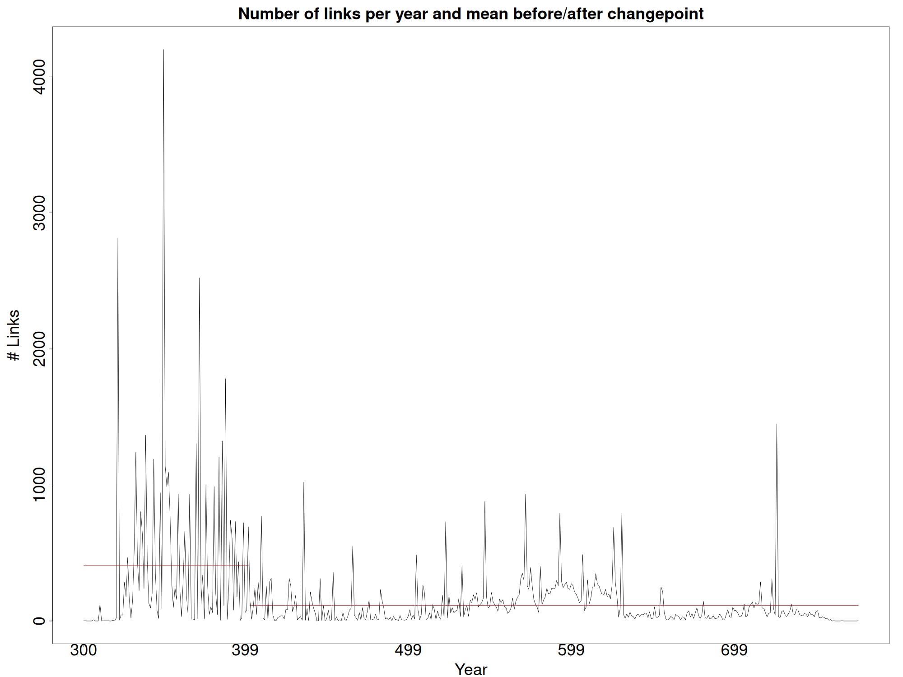

# Late antiquity trade analysis via social networks and shift point analysis 𓊝



Repository for papers, data and stuff related to the analysis of coin hoards for
change points in late Antiquity/early Middle Ages in Europe.

The [repository with code, paper source and data is in GitHub](https://github.com/JJ/medieval-trade).

## Papers

For the time being, these papers:

* For [Statphys 29](https://statphys29.org/): "Finding changepoints in medieval Mediterranean trade networks", check the
  [paper source](abstract-medieval-trade.Rnw) as well as [the paper](https://github.com/JJ/medieval-trade/releases/download/v1.02/abstract-medieval-trade.pdf). The file
  [`data/links_year.rds`](data/links_year.rds) contains the data processed for
  the
  paper. [`scripts/abstract-medieval-trade.R`](scripts/abstract-medieval-trade.R)
  contain the extracted script that generates the chart in the paper, slightly
  modified for the actual poster.

* An extended report is published at the UGR institutional repository, ["Finding
  changepoints in medieval European and Middle Eastern trade
  networks"](https://hdl.handle.net/10481/105018), where the "Danubian
  hypothesis" is proposed: The change in trade patterns before and after the
  changepoint suggest that the fall of the Danube as a trade route internal to
  the empire, as well as probable the *Via Militaris* that run parallel to it,
  totally changed the trading patterns, decreasing the number of trade links and
  creating economic and finally military and political change.

If you want to use the processed data and/or code in this paper, we kindly
request you to cite:

```bibtex
@misc{10481/105018,
year = {2025},
month = {7},
url = {https://hdl.handle.net/10481/105018},
abstract = {Trade networks reflect societal vitality and are thus essential tools to understand historical dynamics, including epochal events. In this paper we will be looking at the Mediterranean trade network reflected in the FLAME dataset, coin hoards found in the region which establish a link between the place the coins were minted and where they were found. We will use changepoint analysis to identify shift points in this trade network, mapping it to actual events (or conjunction of events), and then analyze the existing network prior and after the events. The trade network has regions (identified as current countries) as nodes, and the number of coins of one place found in another as edges.
Changepoint analysis for the time series of the number of links in the network finds a statistically significant changepoint with average links before and after the changepoint plotted. Multiple sequence changepoint, including entropy and high-level network measures, will be also presented, and possible causes for these shifts, looking at historical events as well as changes in edge and node (region) betweenness, will be discussed.},
organization = {This work is supported by the Ministerio español de Economía y Competitividad (Spanish Ministry of Competitivity and Economy) under project PID2023-147409NB-C21.},
keywords = {trade networks},
keywords = {Complex networks},
keywords = {Complex network analysis},
keywords = {Cliometrics},
keywords = {Digital humanities},
title = {Finding changepoints in medieval European and Middle Eastern trade networks},
author = {Merelo Guervos, Juan Julián},
}
```

## Data

Data was obtained from the FLAMEs database. [`data-raw`](data-raw) contains
unprocessed files, [`data/`](data/) the files once processed, that can be used
directly.

## LICENSE

(c) JJ Merelo, 2025. Data and code are licensed under the [Affero GPL
license](LICENSE).


